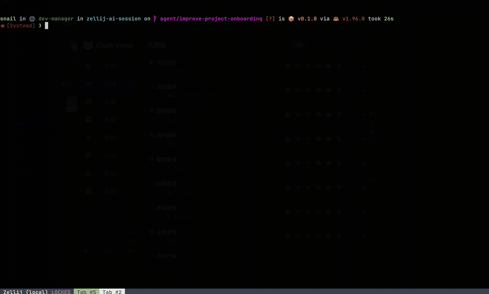

# zellij-ai-session

> 在 Zellij 中按项目统一查找和恢复各类 AI 编码 Agent 会话。

[](https://github.com/snail-vs/zellij-ai-session/actions/workflows/ci.yml)
[](https://github.com/snail-vs/zellij-ai-session/releases/latest)
[](LICENSE)

[English](README.md)

<!--
GIF 插入位置。完成录制后保存为 docs/demo.gif，并将本注释替换为：


-->

Codex、OpenCode、Claude Code 等 Agent CLI 分别保存自己的会话历史。`zellij-ai-session` 会发现这些已有的本地会话，按项目目录统一分组，让用户可以从一个入口搜索并继续之前的工作。

它不替代 Agent，也不迁移会话历史。按下 `Alt s`，选择项目后按 `Enter`；导航器会聚焦正在运行的会话，或者通过原 Agent CLI 恢复历史会话。

## 核心特点

- **项目优先：** 同一项目即使混用多个 Agent，工作记录仍聚合在一起。
- **多 Agent：** 开箱支持 8 种 Agent 会话格式。
- **一个动作继续工作：** `Enter` 既可聚焦运行中的会话，也可恢复历史会话。
- **本地处理：** 会话发现和搜索均在本机完成，不需要账号或云端服务。
- **预编译安装：** Linux 和 macOS 用户无需安装 Rust 工具链。

## 快速开始

前提条件：

- 已安装 Zellij，并且可以从 `PATH` 调用；
- 至少有一个受支持的 Agent CLI 和已有会话。

安装最新版本：

```bash
curl -fsSL https://raw.githubusercontent.com/snail-vs/zellij-ai-session/main/install.sh | bash
```

安装脚本会下载预编译产物、校验 `SHA256SUMS`，并配置 `Alt s` 快捷键。安装后重启 Zellij 或重新加载配置，再按 `Alt s`。

如果希望先检查脚本并固定版本：

```bash
curl -fsSL https://raw.githubusercontent.com/snail-vs/zellij-ai-session/v0.1.6/install.sh \
  -o /tmp/zellij-ai-session-install.sh
less /tmp/zellij-ai-session-install.sh
bash /tmp/zellij-ai-session-install.sh --version v0.1.6
```

安装脚本会：

- 将原生 indexer 和 Zellij WASI 插件安装到当前用户目录；
- 创建或更新 `~/.config/zellij/config.kdl`；
- 绑定 `Alt s`，用于打开或聚焦导航器；
- 默认在新 tab 中恢复会话；
- 修改已有配置前备份为 `.bak.zellij-ai-session`。

常用选项：

```bash
./install.sh --open-mode pane        # 在 pane 而非 tab 中恢复
./install.sh --key "Ctrl g"          # 使用其他快捷键
./install.sh --version v0.1.6        # 安装指定版本
./install.sh --no-keybind            # 安装文件但不修改 Zellij 配置
./install.sh --from-source           # 从源码构建，需要 Rust
```

卸载：

```bash
./uninstall.sh
```

卸载会移除 indexer、WASI 插件和脚本管理的快捷键；配置备份和 Agent 会话历史会保留。

## 使用方式

```text
Enter   打开或恢复会话
n       新建会话并选择 Agent
x       关闭 runtime，保留 Agent 历史
/       搜索所有已发现会话
r       刷新索引
q       关闭导航器
```

存在匹配的 Zellij runtime 时，`Enter` 会直接聚焦；否则会根据 `open_mode`，在 tab 或 pane 中执行对应 Agent 的原生恢复命令。

搜索范围包括会话标题、项目、目录和 Agent 名称，支持中文等 Unicode 子串。

## 支持的 Agent

| Agent | 本地会话存储 | 恢复命令 |
| --- | --- | --- |
| [Codex](https://github.com/openai/codex) | `~/.codex/sessions/` 和 `~/.codex/session_index.jsonl` | `codex resume <id>` |
| [OpenCode](https://opencode.ai) | `~/.local/share/opencode/opencode.db`（XDG） | `opencode --session <id>` |
| Pi | `~/.pi/agent/sessions/` | `pi --session <path>` |
| Reasonix | `~/.reasonix/sessions/` | `reasonix --resume <path>` |
| Codewhale | `~/.codewhale/sessions/` 或旧版 `~/.deepseek/sessions/` | `codewhale --resume <id>` |
| [Claude Code](https://claude.com/claude-code) | `~/.claude/projects/` | `claude --resume <id>` |
| [Qwen Code](https://github.com/QwenLM/qwen-code) | `~/.qwen/projects/` | `qwen --resume <id>` |
| [Goose](https://block.github.io/goose/) | `~/.local/share/goose/sessions/sessions.db`（XDG） | `goose session --resume --session-id <id>` |

环境变量覆盖：

- Codewhale：`CODEWHALE_HOME`
- Reasonix：`REASONIX_HOME` / `REASONIX_STATE_HOME`
- Claude Code：`CLAUDE_CONFIG_DIR`
- Qwen Code：`QWEN_CONFIG_DIR`
- OpenCode / Goose：`XDG_DATA_HOME`

无法稳定地将历史会话映射回项目目录的 Agent，不会加入默认注册表。可以通过 [Agent 请求模板](https://github.com/snail-vs/zellij-ai-session/issues/new/choose) 提议新的适配。

## 隐私与安全

- Indexer 会读取受支持 Agent 的本地会话元数据。当 Agent 没有提供会话标题时，部分适配器会读取第一条用户消息作为备选标题。
- 会话数据仅在本机处理；程序没有遥测功能，也不会上传提示词或会话历史。
- 安装脚本只会通过网络从 GitHub 获取 Release 元数据、二进制文件和校验和。
- 恢复会话时，会以对应 Agent 原有的权限和配置启动其 CLI。
- 按 `x` 只关闭匹配的 Zellij runtime，不会删除 Agent 保存的历史会话。
- 安装脚本修改 Zellij 配置前会创建备份；如果希望手动配置，请使用 `--no-keybind`。

提交问题时不要附加未经处理的会话文件或提示词。请从日志和配置片段中删除用户名、主目录路径、仓库名称及密钥。

## 兼容性

Release 提供以下预编译产物：

- Linux：`x86_64`、`aarch64`
- macOS：Intel `x86_64`、Apple Silicon `aarch64`

当前插件基于 Zellij `0.44.3` Plugin API 构建。如果遇到兼容问题，请在 Bug 报告中注明 Zellij 版本、操作系统、CPU 架构和受影响的 Agent。

## 配置

默认安装位置：

```text
~/.local/bin/zellij-ai-session-index
~/.local/share/zellij-ai-session/zellij_ai_session_plugin.wasm
~/.config/zellij/config.kdl
```

可通过 `ZELLIJ_AI_SESSION_BIN_DIR`、`ZELLIJ_AI_SESSION_DATA_DIR` 和 `ZELLIJ_AI_SESSION_CONFIG_FILE` 修改路径；通过 `ZELLIJ_AI_SESSION_REPO` 和 `ZELLIJ_AI_SESSION_VERSION` 选择 Release 来源及版本。

手工配置 Zellij：

```kdl
LaunchOrFocusPlugin "file:/absolute/path/to/zellij_ai_session_plugin.wasm" {
    floating true
    move_to_focused_tab true
    skip_plugin_cache true
    indexer "/absolute/path/to/zellij-ai-session-index"
    open_mode "tab"
}
```

Release 产物设计参见 [docs/distribution.md](docs/distribution.md)。

## 开发

从源码构建：

```bash
cargo build -p zellij-ai-session-index --release
cargo build -p zellij-ai-session-plugin \
  --target wasm32-wasip1 \
  --features wasm \
  --release
```

验证改动：

```bash
cargo fmt --all --check
cargo test --workspace
cargo check -p zellij-ai-session-plugin \
  --target wasm32-wasip1 \
  --features wasm
```

新增 Agent 需要在 `crates/core/src/lib.rs` 增加一行 `AgentMeta` 注册信息，并在 `crates/indexer/src/` 下实现一个 `AgentAdapter`。提交 PR 前请阅读 [CONTRIBUTING.md](CONTRIBUTING.md)。

## 许可证

[MIT](LICENSE)
